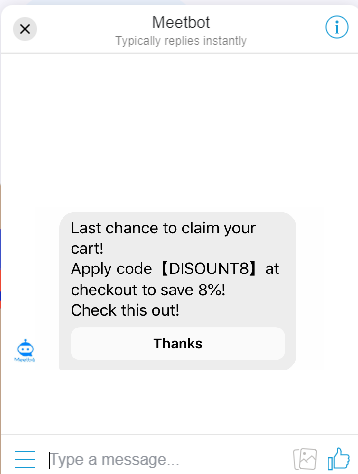

# 购物车召回

通过“购物车召回”功能，您可以预设定时消息/优惠券，利用Messenger召回那些加购却迟迟未下单的用户，提高您的销售额。

### 效果预览



## 配置方法

####  Shopify商家

如果你是 Shopify 商家，推荐直接使用我们开发的 [Cart Activator ](https://apps.shopify.com/cart-activator)APP，不需要编辑代码，几分钟完成设置


#### 非Shopify商家

如果您不是Shopify商家，也可以通过简单的手动配置实现购物车召回。

1. 在【内容管理】&gt;【自定义内容】中创建一条召回消息


 2. 【受众人群】&gt;【受众定义】，创建受众。  
添加事件“added\_to\_cart”，选择发生、添加事件“purchase”，选择“不发生”；即添加购物车但未付款的用户


3. 【受众人群】&gt;【 触发规则】，添加触发规则。  
 选择触发事件“added\_to\_cart”、受众选择“Users who abandoned cart”、设置消息延迟时间、发送内容选择之前创建的内容块


4.【推广工具】&gt;【来源管理】，添加优惠券插件


5.在您的网站商品页添加代码  
**HTML代码**粘贴至商品页Add to Cart（触发事件）按钮下方、**初始化代码**粘贴至店铺页`<head>`标签内


6.在用户点击加车时，向Meetbot发送`add_to_cart`事件。实际情况中，按钮可能有其他元素，不需要改动，添加如下`onclick`代码即可。

```javascript
<button [按钮中可能有的其他内容] onclick="window.BH.Event.addedToCart({
    sku: '260874012',
    product: 'Leaf Print Padded Bikini Set - Bee Yellow S',
    currency: 'USD',
    price: 26.99,
})";>
</button>
```


7.在购买完成页，发送`purchase`事件，确保用户在购买完成后不再向其发送召回消息。

```markup
<!-- 这是配置的初始化脚本，和在网页中部署一样 -->
<script src="https://meetbot.oss-cn-hongkong.aliyuncs.com/rapture-api/prod/Meetbot/Meetbot_channel_script_SoxwOfmvv3.js"></script>

<script>
window.bhAsyncInit.push(function() {
    window.BH.Event.purchase({
        // 订单号
        orderNumber: '123',
        // 币种
        currency: 'US',
        // 总金额
        totalPrice: 12345,
    })
});
</script>
```

这样，购物车召回的配置就完成了。

当用户勾选插件领用优惠券后，点击加购就会自动触发召回消息的定时推送了~


