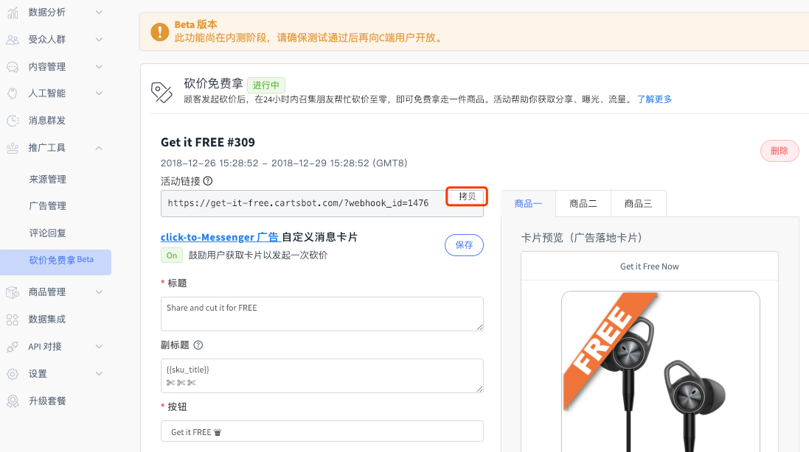

# 砍价免费拿活动

### 效果预览

 **通过顾客自发分享，获取裂变式商品传播。**

##  配置方法

创建并发布活动共三步：**创建商品、创建活动、创建入口**。

1.【商品管理】&gt;【自定义商品】中创建3个活动商品

填写必要的选项，每个商品可以创建最多3个属性

2.至【推广工具】&gt;【砍价免费拿】，设置时间、活动SKU、数量、需砍次数。  
活动SKU数量与自定义商品库存数无关，**系统仅根据这里的活动库存，来继续/停止砍价团。**


**活动SKU、数量、需砍次数在创建后无法修改，请确认后再创建。**如果需要修改，请创建一个新的砍价免费拿活动。


**活动时间：**在活动开始前后，顾客进入都将收到“Game is over”的提示，删除活动会有一样的效果。若活动已结束，则顾客无法发起新的砍价，但已经发起的砍价可以继续进行，不受影响。

3.活动设置完毕后，我们可以通过**Messenger消息**推送给已有用户，或通过**Click-to-Messenger广告**触达新客户

方式1：拷贝活动链接，放到一个网址按钮中。


 **设置视窗高度为“全屏”（务必设置，否则页面将无法获取顾客FB信息，导致不能正常砍价）**


方式2：我们帮你创建了活动消息落地页的JSON代码。将活动页JSON拷贝即可用于广告投放。\(广告投放详情可参考页面下方链接）



