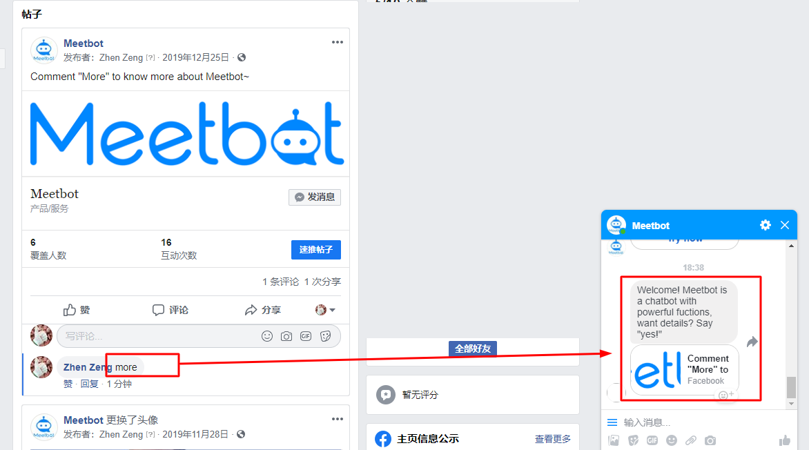

# 帖子评论自动回复

当用户在你的Facebook帖子下回复内容后，系统可以自动通过你的 Messenger 机器人向用户发一条您设置的自定义消息。

### 效果预览

## 配置方法

1. 发布一个Facebook帖子
2. 在【推广工具】&gt;【评论回复】中新建一个回复

1. **设置名称：**设置一个名称，方便识别
2. **优先级：**当您对同一个帖子设置多条回复规则时，可以通过使用优先级来规定不同回复的优先程度。您可以设置0~100的整数，数字越大代表优先级越高。当系统对用户发出的评论进行判断时，会先去识别优先级高的规则，如果满足则发出回复，如果不满足才会继续去寻找更低优先级的规则去匹配。如果优先级一致，则回复最新创建的规则。 
3. **活动时间：**默认进行中，规则一直有效**，**可以指定回复规则的有效期的时间段，
4. **适用于:** 默认支持所有帖子，可以指定某一个帖子

4. 点击“创建”即完成了配置~

#### 当用户评论帖子，就会收到一条自动回复文本及该帖子链接啦。

