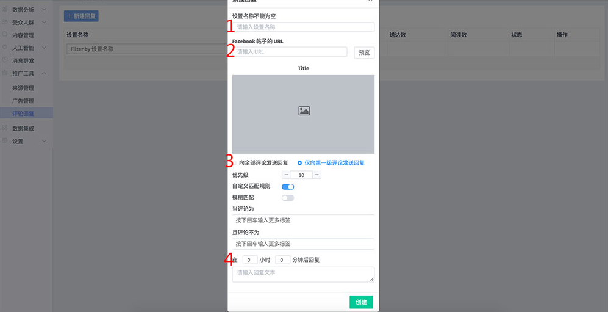

# 贴子评论自动回复

当用户在你的Facebook帖子下回复内容后，系统可以自动通过你的 Messenger 机器人向用户发一条您设置的自定义消息。

### 效果预览

## 配置方法

1. 发布一个Facebook帖子，帖子必须包含图片或视频（不能是纯文本）
2. 获取帖子的URL

3. 在【推广工具】&gt;【评论回复】中新建一个回复

**1）设置名称：**设置一个名称，方便识别  
**2）Facebook 帖子的 URL：**黏贴 Facebook 帖子的URL地址，并点击“预览”  
**3）评论规则设置：**您可以设置向所有评论用户或是向评论了指定关键字的用户发送自动消息  
**4） 消息发送时间&回复文本：**用户会在触发规则后的一定时间收到该条自动回复的消息内容

4. 点击“创建”即完成了配置~

#### 当用户评论帖子，就会收到一条自动回复文本及该帖子链接啦。

